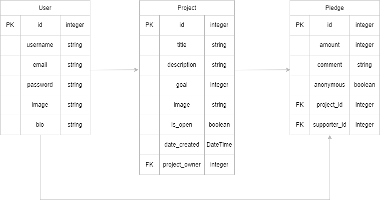

# Django Project Back End
Brittany Evans

## Planning:
### Concept/Name
A freelancing platform that connects businesses with independent professionals in tech and design. It offers a space for companies to post jobs and for freelancers to showcase their skills and submit project proposals.

### Intended Audience/User Stories
- Businesses hiring for a project
- Freelancers looking for work

### Front End Pages/Functionality
- Home Page
    - Log In/Create Account
    - Display all projects
    - Click project to view project detail
- Project Pages
    - Project Description
    - About the client
    - Features such as hours, duration, project type
    - Skills and expertise
- User Profile
    - Update profile
    - Search projects
    - Submit a proposal

### API Spec

| URL                    | HTTP METHOD | PURPOSE                 | REQUEST BODY   | SUCCESS RESPONSE CODE | AUTHENTICATION/AUTHORISATION                       |
| ---------------------- | ----------- | ----------------------- | -------------- | --------------------- | -------------------------------------------------- |
| /projects/             | GET         | Return all projects     | N/A            | 200                   | N/A                                                |
| /projects/:id          | GET         | Return a project by id  | N/A            | 200                   | N/A                                                |
| /projects/             | POST        | Create a new project    | Project object | 201                   | Login required                                     |
| /projects/:id          | PUT         | Update the project      | Project object | 200                   | Login required /Must be the project owner          |
| /projects/:id          | DELETE      | Delete the project      | N/A            | 200                   | Login required /Must be the project owner          |
|                        |             |                         |                |                       |                                                    |
| /pledges/              | GET         | Return all pledges      | N/A            | 200                   | N/A                                                |
| /pledges/:id           | GET         | Return a pledge by id   | N/A            | 200                   | N/A                                                |
| /pledges/              | POST        | Create a pledge         | Pledge object  | 201                   | Login required                                     |
| /pledges/:id           | PUT         | Update a pledge         | Pledge object  | 200                   | Login required /Must be the project owner          |
| /pledges/:id           | DELETE      | Delete a pledge by id   | N/A            | 200                   | Login required /Must be the project owner          |
|                        |             |                         |                |                       |                                                    |
| /users/                | GET         | Returns all users       | N/A            | 200                   | N/A                                                |
| /users/                | POST        | Create user account     | User object    | 201                   | N/A                                                |
| /users/login           | POST        | Login                   | User object    | 201                   | N/A                                                |
| /users/:id             | PUT         | Update the user by id   | User object    | 200                   | Login required /Must be the project owner          |
| /users/:id             | DELETE      | Delete the user by id   | N/A            | 200                   | Login required /Must be the project owner          |

### DB Schema

